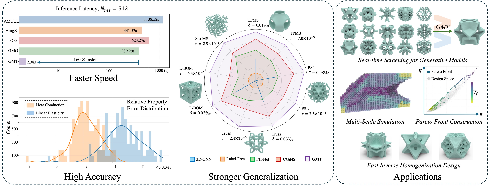

# GMT: A Geometric Multigrid Transformer Solver for Microstructure Homogenization

Official implementation of **GMT: A Geometric Multigrid Transformer Solver for Microstructure Homogenization**, accepted to the **SIGGRAPH 2026 Journal Track**.


<!-- [](https://dl.acm.org/doi/abs/10.1145/3637528.3671961) &emsp;&emsp;  -->
[](https://arxiv.org/abs/2604.26518)



GMT is a neural solver for large-scale microstructure homogenization. It combines sparse 3D feature extraction, Point Transformer V3 blocks, and a geometric multigrid solver to accelerate the linear elasticity solves that dominate high-resolution homogenization pipelines.

This repository currently provides:

- Training code based on PyTorch Lightning
- Sparse voxel preprocessing utilities
- The default experiment configuration used by the release
- Checkpoint and TensorBoard logging support

## Repository Layout

```text
.
|-- configs/train.yaml          # Default training configuration
|-- datagen/generate.py         # Raw voxel to sparse .npz preprocessing
|-- environment.yml             # Conda environment
|-- main.py                     # Training entry point
`-- train/
    |-- dataset.py              # Sparse dataset and collate function
    |-- model.py                # GMT model
    |-- EBE_GMG.py              # Element-by-element geometric multigrid solver
    |-- PTv3_3.py               # Point Transformer V3 backbone
    |-- sp_lightning.py         # Lightning module and data module
    `-- _utils.py               # FEM assembly and solver utilities
```

## Environment

The released environment is captured in `environment.yml`.

Requirements:

- Linux is recommended
- NVIDIA GPU with CUDA support
- Conda or Mamba

Create and activate the environment:

```bash
conda env create -f environment.yml
conda activate GMT
```

The environment includes CUDA-enabled PyTorch, Lightning, spconv, flash-attn, and Point Transformer related sparse operators. If your local CUDA driver or GPU architecture differs from the release machine, you may need to rebuild the sparse CUDA extensions for your system.

## Data Format

Training expects processed `.npz` files. Each file should contain:

- `coords`: active node coordinates, shape `(N, 3)`
- `node_type`: per-node local occupancy features, shape `(N, 8)`
- `voxel`: binary solid voxel grid, shape `(R, R, R)`
- `node_index`: element-to-node connectivity, shape `(E, 8)`

<!-- A typical processed-data layout is:

```text
data/Train/PSL
data/Train/Truss
data/Train/TPMS
data/Vail/PSL
data/Vail/Truss
data/Vail/TPMS
```

Update `train_data_path` and `vail_data_path` in `configs/train.yaml` to match your local dataset paths. The default release config uses `resolution: 64`. -->

## Preprocessing Voxels

Use `datagen/generate.py` to convert raw voxel grids into the processed `.npz` format.

Supported raw inputs:

- `.npy`: dense voxel array
- `.csv`: flattened or dense voxel values
- `.npz`: must contain a `voxel` array

Example:

```bash
python datagen/generate.py \
  --input_dirs path/to/raw_voxels \
  --out_dir data/Train/Truss \
  --res 64 \
  --type Truss \
  --device cuda:0
```

The script treats positive values as solid voxels and writes one processed `.npz` file per input sample.

## Training

Edit `configs/train.yaml` before training. The most commonly changed fields are:

- `train_data_path`, `vail_data_path`: processed training and validation folders
- `batch_size`, `num_works`: dataloader settings
- `resolution`: voxel resolution
- `model.*`: transformer depth, channels, heads, and window sizes
- `GMG.*`: geometric multigrid smoothing and cycle settings
- `pre_train`: checkpoint path for resuming training, or `null`

Run on one visible GPU:

```bash
CUDA_VISIBLE_DEVICES=0 python main.py configs/train.yaml
```

Run with multiple visible GPUs:

```bash
CUDA_VISIBLE_DEVICES=0,1,2,3 python main.py configs/train.yaml
```

`main.py` uses PyTorch Lightning DDP. The number of visible GPUs is controlled by `CUDA_VISIBLE_DEVICES`.

## Outputs

Outputs are written under `output_path` in the config. With the default config:

```text
result/
|-- checkpoint/     # Lightning checkpoints
`-- tf_logs/        # TensorBoard logs
```

Launch TensorBoard with:

```bash
tensorboard --logdir result/tf_logs
```
<!-- 
## Current Release Notes

- This snapshot focuses on training and voxel preprocessing.
- Public dataset download links and pretrained checkpoints are not included in this repository snapshot.
- If you use a different voxel resolution, update both the preprocessing `--res` argument and `resolution` in the config.

## Citation

If you use this code, please cite:

```bibtex
@misc{xing2026gmt,
  title        = {GMT: A Geometric Multigrid Transformer Solver for Microstructure Homogenization},
  author       = {Xing, Yu and Liu, Yang and Xue, Tianyang and Lu, Lin},
  year         = {2026},
  eprint       = {2604.26518},
  archivePrefix = {arXiv},
  note         = {Accepted to the SIGGRAPH 2026 Journal Track}
}
``` -->
